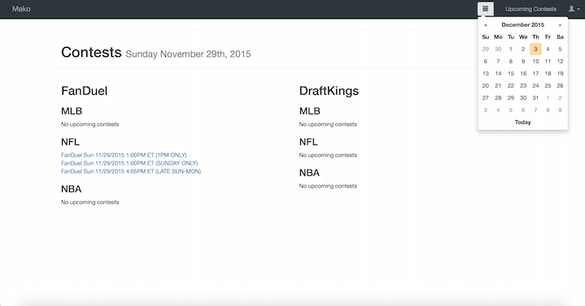
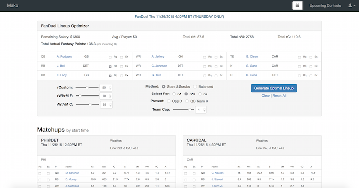
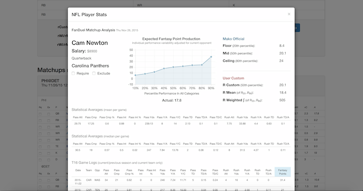

# Mako

This is the front-end code for Mako. Since it is a data visualization and manipulation layer, this repository is being left public as a portfolio project. Feel free to see how I did things with Ember.js.

Most of the real work is done on the backend, which scrapes publicly available sports statistics and upcoming matchup data, caches them in a NoSQL database, and uses a custom algorithm to perform statistical analysis on the matchups and generate rating distributions tuned to each major DFS site. That isn't being released, since the thing worked and I might one day return to taking money from casual sports fans if the DFS industry does a turnaround.

